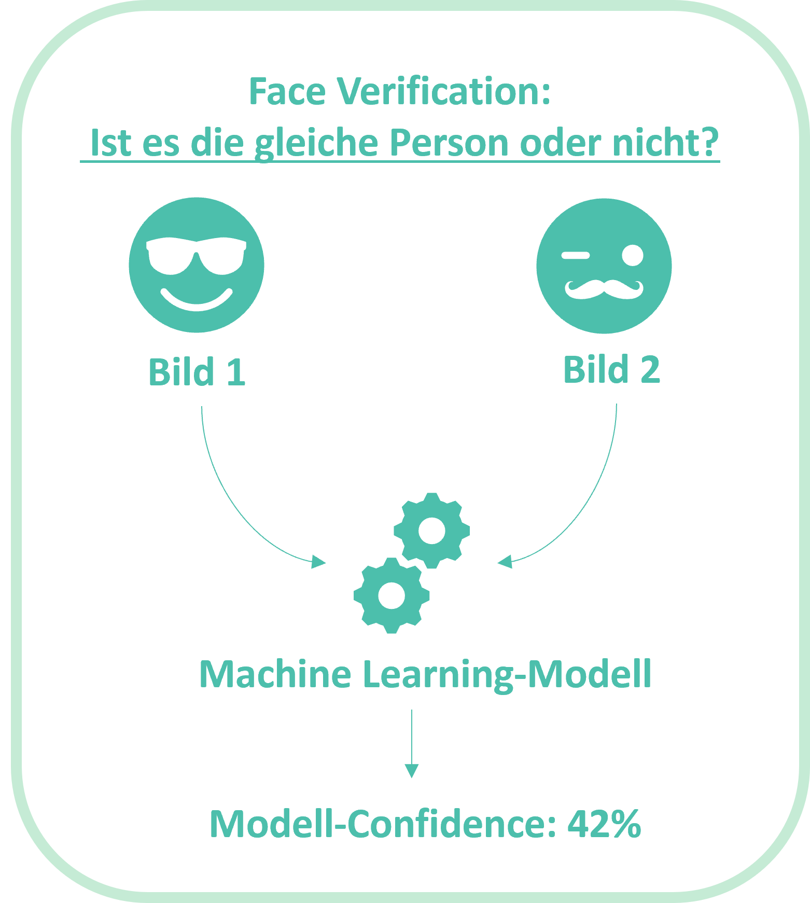
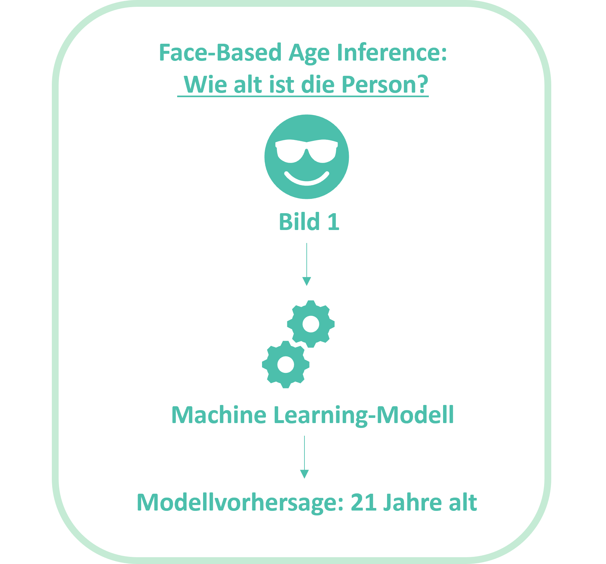

```{r configuration, include = FALSE}
# The slide layout is inspired by https://github.com/spcanelon/xaringan-rladies-xalapa 
# Many thanks to @spcanelon for providing many cool ideas and templates

library(knitr)
library(metathis)
library(cowplot)
library(fontawesome)
library(emo)
library(xaringanExtra)
library(xaringanthemer)
library(RefManageR)
library(magick)

opts_chunk$set(
  echo = FALSE,
  warning = FALSE,
  collapse = FALSE,
  dpi = 300,
  fig.show = TRUE
)

knit_engines$set("yaml", "markdown")

xaringanExtra::use_tile_view()
xaringanExtra::use_clipboard()
xaringanExtra::use_share_again()
xaringanExtra::style_share_again(share_buttons = c("twitter", "linkedin", "pocket"))

style_duo_accent(
  primary_color = "#c5ebd5",
  secondary_color = "#4cbfac",
  inverse_header_color =  "#FFFFFF",
  text_color = "#636363",
  title_slide_text_color = "#FFFFFF",
  header_color = "#4cbfac"
)

BibOptions(
  check.entries = FALSE,
  bib.style = "numeric",
  cite.style = "numeric",
  style = "markdown",
  hyperlink = FALSE,
  dashed = FALSE
)
bibliography <- ReadBib("./bibliography.bib", check = FALSE)
```

```{r meta, echo=FALSE, warning=FALSE}
meta() %>%
  meta_general(
    description = "Defensio",
    generator = "xaringan and remark.js"
  ) %>% 
  meta_social(
    og_author = "Till Bieg",
    twitter_card_type = "summary_large_image",
    twitter_creator = "@abc"
  )
```

class: right, middle, inverse, titular
background-image: url(img/title-background.png)
background-size: contain
background-position: -20% 0%


## <div class="title"> `r rmarkdown::metadata$title` </div>
## `r rmarkdown::metadata$subtitle`
### `r rmarkdown::metadata$author`
### `r rmarkdown::metadata$date`

[`r fontawesome::fa("github")` bit.ly/face-benchmark](https://bit.ly/face-benchmark) 

---
class: center, middle

# Überblick

----

<p style = "color: #4cbfac; line-height: 200%; size: 12;"> Einführung <br>
Theoretischer Hintergrund <br>
Forschungsfragen <br>
Experiment 1 (Methode, Ergebnisse) <br>
Experiment 2 (Methode, Ergebnisse) <br>
Experiment 3 (Methode, Ergebnisse) <br>
Einordnung der Ergebnisse, Limitationen und Implikationen <br> 
Schlussfolgerung </p>

---
class: inverse, middle, center

`r fontawesome::fa("play", fill = "#c5ebd5", height = "3em")`
# Einführung

----
---
## `r fontawesome::fa("play", fill = "#c5ebd5")` Einführung 
----
* Technischer Fortschritt führt zu immer breiterer Anwendung von Automated Facial Analysis in verschiedensten Domänen `r Cite(bibliography, c("lynch2020face", "shepley2019deep", "norval2017public"))` und Unternehmen haben begonnen Automated Facial Analysis als <mark class="turquoise">kommerzielle Services</mark> anzubieten `r Cite(bibliography, c("buolamwini2018gender", "amazon_2021_rekog", "face_2021_face", "microsoft_2021_face"))`


* <mark class="turquoise">Automated Facial Analysis</mark>: Überbegriff, der verschiedene computergestützte Abläufe bezeichnet, die die Extraktion von Informationen aus digitalisierten Bildern von Gesichtern und die Identifizierung bedeutsamer Muster daraus beinhalten `r Cite(bibliography,  c("buolamwini2018gender", "cohn2007use"))`

* Bisherige Forschung impliziert <mark class="turquoise">demografische Biases</mark> in kommerziellen Services `r Cite(bibliography, c("buolamwini2018gender", "raji2019actionable", "hupont2019demogpairs", "grother2019face", "howard2020quantifying", "wang2019racial", "robinson2020face", "el2016face"))`, allerdings existieren Forschungslücken:
  * Benchmarks kommerzieller Services für Face Verification bei "Unconstrained Images" unter Berücksichtigung von Gender, Race und Age
  * Vergleich kommerzieller Service für Face Verification bei "Unconstrained Images" über die Zeit
  * Benchmarks kommerzieller Services für Face-Based Age Inference unter Berücksichtigung von Gender, Race und Age

* <mark class="turquoise">Ziel der Arbeit:</mark> Untersuchung dieser Forschungslücken, um Biases aufzudecken, Transparenz zu unterstützen und die empirische Grundlage für Entscheidungen zum Einsatz von Artifical Intelligence zu erweitern

---
class: inverse, middle, center

`r fontawesome::fa("book", fill = "#c5ebd5", height = "3em")`
# Theoretischer Hintergrund

----
---
## `r fontawesome::fa("book", fill = "#c5ebd5")` Theoretischer Hintergrund - Fairness in Machine Learning 
----
* Moderne Machine Learning-Applikationen (Automated Facial Analysis und darüber hinaus) basieren oft auf großen Datenmengen `r Cite(bibliography,  c("francois2017deep", "cavazos2020accuracy"))`

* <mark class="turquoise">Biases</mark> im Entwicklungsprozess (z.B. nicht ausgewogene Trainingsdaten) können sich in Biases in den jeweiligen Modellen übertragen `r Cite(bibliography, c("maity2020there", "cavazos2020accuracy", "klare2012face", "kortylewski2019analyzing", "zhang2018mitigating"))`

* Potentielle Folge: <mark class="turquoise">Diskrimierung, ungerechte bzw. falsche Entscheidungen</mark> (z.B. Kreditvergabe, Strafverfolgung, Berufsförderung)

* Motiviert hierdurch: <mark class="turquoise">Fair Machine Learning</mark> `r Cite(bibliography,  c("belamy19ai"))`

---
## `r fontawesome::fa("book", fill = "#c5ebd5")` Theoretischer Hintergrund - Fairness in Machine Learning 
----
* Verschiedene Klassen von <mark class="turquoise">Definitionen für Fairness</mark> im Kontext von Machine Learning haben sich etabliert `r Cite(bibliography,  c("corbett2018measure"))`

* Je nach Kontext weisen die verschiedenen Definitionen von Fairness Limitationen auf `r Cite(bibliography,  c("corbett2018measure"))`

* Im Kontext der Arbeit gebräuliche Definition: <mark class="turquoise">Classification Parity</mark> `r Cite(bibliography,  c("corbett2018measure"))`
  * Definition: Leistung eines Modells soll bezüglich Gruppen, die durch bestimmte "Protected Attributes" (z.B. Gender, Race, Age) definiert sind, gleich bzw. ähnlich sein
  * Beispiel: Bei einem Modell zur Face Verification sollte die Fehlerrate bei African Females auf ähnlichem Niveau sein wie bei Caucasian Males

---
## `r fontawesome::fa("book", fill = "#c5ebd5")` Theoretischer Hintergrund - Demographische Dimensionen in Machine Learning 
----
* <mark class="turquoise">"Demografic"</mark>: "eine Teilmenge der Bevölkerung, die ein ähnliches Alter, das gleiche Geschlecht und so weiter hat" `r Cite(bibliography, "oxford_demo")` 

* Im Kontext von Automated Facial Analysis werden zumeinst drei demografische Dimensionen bezüglich Biases berücksichtigt:
  * <mark class="turquoise">Gender</mark> (Geschlecht): Meist auf binäre Kategorien reduziert (Weiblich, Männlich) `r Cite(bibliography, c("buolamwini2018gender", "robinson2020face", "hupont2019demogpairs", "karkkainen2019fairface", "karkkainen2021fairface", "zhang2017age_utk"))`
  * <mark class="turquoise">Race</mark>: Unscharf definierter Begriff, der sich auf geografische, soziale und kulturelle Ähnlichkeiten bezieht `r Cite(bibliography, c("suyemoto2020we", "bhopal2004glossary"))`
  * <mark class="turquoise">Age</mark> (Alter): In Jahren - oft Unterteilung in Altersgruppen `r Cite(bibliography, c("grother2019face", "el2016face", "karkkainen2021fairface"))`
  
* Wahre Komplexität demographischer Dimensionen im Kontext von Machine Learning häufig (noch) nicht abgebildet `r Cite(bibliography, c("buolamwini2018gender"))`
  
* <mark class="turquoise">Intersektionale Betrachtung</mark> `r Cite(bibliography, "crenshaw1989demarginalizing")`, besonders wichtig, da Studien gezeigt haben, dass Biases in Bezug auf intersektionale Gruppen erhöht sein können `r Cite(bibliography, c("buolamwini2018gender", "hupont2019demogpairs"))`

---
## `r fontawesome::fa("book", fill = "#c5ebd5")` Theoretischer Hintergrund - Kommerzielle Services für Automated Facial Analysis
----
.pull-left[

* Zahlreiche Unternehmen haben begonnen Automated Facial Analysis als <mark class="turquoise">kommerzielle Services</mark> anzubieten, z.B. Amazon, Microsoft, Megvii, Baidu, Kairos, Lambda Labs `r Cite(bibliography, c("amazon_2021_rekog", "kairos_2021_face", "lambda_2021_face", "face_2021_face", "microsoft_2021_face"))`

* <mark class="turquoise">Zahlreiche Use Cases</mark> abgedeckt, z.B.: Face Verification, Gender Classification, Age Inference, Landmark Extraction, Emotion Detection, etc. `r Cite(bibliography, c("amazon_2021_rekog", "kairos_2021_face", "lambda_2021_face", "face_2021_face", "microsoft_2021_face"))`

* Kommerzielle Services in der Regel als Application Programming Interfaces (APIs) zur Verfügung gestellt, die es Unternehmen und Privatpersonen erlauben, Services für eigene Anwendungen zu nutzen
]

.pull-right[

* <mark class="turquoise">Kein direkter Einblick</mark> in Biases dieser Systeme für Dritte möglich


]

---
## `r fontawesome::fa("book", fill = "#c5ebd5")` Theoretischer Hintergrund - Demographische Biases in Face Verification
----

.pull-left[
* <mark class="turquoise">Face Verification</mark>: Algorithmus, der versucht zu erkennen, ob zwei Bilder eines Gesichts zu derselben Person gehören `r Cite(bibliography, "sun2013hypird")`

* Hohe Relevanz und viele Anwendungsfälle (Strafverfolgung, Authentifzierung, etc.) `r Cite(bibliography, c("interpol_2021", "nyt_2021"))`

]

.pull-right[

]

---
## `r fontawesome::fa("book", fill = "#c5ebd5")` Theoretischer Hintergrund - Demographische Biases in Face Verification
----

* Studien haben bereits <mark class="turquoise">demograpische Biases</mark> in (kommerzieller) Face Verification gefunden `r Cite(bibliography, c("hupont2019demogpairs", "grother2019face", "wang2019racial", "robinson2020face", "el2016face", "cavazos2020accuracy", "krish2019characterizing"))`, z.B.:
  * Modelle sind am genauesten bei Males, Caucasians oder Personen mittleren Alters
  * Modellgenauigkeit ist schlechter bei African und Asian Females oder bei jungen Menschen
  
* Trotz zahlreicher Studien: <mark class="turquoise">Forschungslücken</mark>

  * Benchmarks kommerzieller Services für Face Verification bei "Unconstrained Images" unter Berücksichtigung von Gender, Race und Age
  * Vergleich kommerzieller Service für Face Verification bei "Unconstrained Images" über die Zeit


---
## `r fontawesome::fa("book", fill = "#c5ebd5")` Theoretischer Hintergrund - Demographische Biases in Face-Based Age Inference
----

.pull-left[
* <mark class="turquoise">Face-Based Age Inference</mark>: Schätzung des Alters einer Person auf der Grundlage eines Bildes ihres Gesichts `r Cite(bibliography, c("deng2021multifeature"))`

* Viele aktuelle Forschungsarbeiten beschäftigen sich mit der Verbeserung von Face-Based Age Inference `r Cite(bibliography, c("akhand2020human", "karkkainen2019fairface", "karkkainen2021fairface", "guehairia2020feature", "rahman2020human", "bekhouche2020comparative", "gong2020jointly", "agbo2019face"))`

* Wenige Studien haben sich mit demographischen Biases in Face-Based Age Inference beschäftigt `r Cite(bibliography, c( "karkkainen2019fairface", "karkkainen2021fairface"))`

* Insbesondere <mark class="turquoise">Studien zu demographischen Biases in kommerziellen Services</mark> sind selten (erstaunlich, weil Face-Based Gender Inference große öffentliche Aufmerksamkeit erhalten hat `r Cite(bibliography, c("buolamwini2018gender", "raji2019actionable"))`
]

.pull-right[

]

---
class: inverse, middle, center

`r fontawesome::fa("question", fill = "#c5ebd5", height = "3em")`
# Forschungsfragen
----

---
## `r fontawesome::fa("question", fill = "#c5ebd5")` Forschungsfragen
----
RQ 1: Wie unterscheidet sich die Performance kommerzieller Services für Face Verification unter Verwendung von Unconstrained Images hinsichtlich demografischer Gruppen (Gender, Race und Age)?

RQ 2: Wie unterscheiden sich kommerzielle Services für Face Verification hinsichtlich ihrer Performance unter Verwendung von Unconstrained Images?

RQ 3: Wie hat sich die Performance kommerzieller Services für Face Verification unter Verwendung von Unconstrained Images im Vergleich zu früheren Benchmarks verändert? 

RQ 4: Wie unterscheidet sich die Performance kommerzieller Services für Face-Based Age Inference (unter Verwendung von Unconstrained Images) hinsichtlich demografischer Gruppen (Gender, Race und Age)?

RQ 5: Wie unterscheiden sich kommerzielle Services für Face-Based Age Inference hinsichtlich ihrer Performance (unter Verwendung von Unconstrained Images)?

---
class: inverse, middle, center

`r fontawesome::fa("vial", fill = "#c5ebd5", height = "3em")`
# Experiment 1 (Methode, Ergebnisse)

----
---
## `r fontawesome::fa("vials", fill = "#c5ebd5")` Experiment 1 - Methode
----

.pull-left[

* Benchmark kommerzieller Face Verification Services (Amazon, Megvii, Microsoft) unter Verwendung von Unconstrained Images (<mark class="turquoise">RQ 1, RQ 2</mark>)

* Berücksichtigung von <mark class="turquoise">Gender</mark> (Female, Male), <mark class="turquoise">Race</mark> (African, Asian, Caucasian, Indian) und <mark class="turquoise">Age</mark> (<30, 30-39, 40-49, 50+)</mark>

* Verwendeter Datensatz: <mark class="turquoise">Balanced Faces in the Wild (BFW) `r Cite(bibliography, c("robinson2020face"))`</mark>

  * 20,000 Unconstrained Images von 800 Individuen balanciert nach Gender und Race und entsprechende Labels
  
  * <mark class="turquoise">Keine Labels für Age</mark>

]

.pull-left[
.center[

]
]

---
## `r fontawesome::fa("vials", fill = "#c5ebd5")` Experiment 1 - Methode
----

* <mark class="turquoise">Labelling von Age</mark> für alle 20,000 Bilder im Datensatz nach der Methode von `r Cite(bibliography, c("karkkainen2021fairface"))`

* <mark class="turquoise">Auswahl von Bildpaaren</mark>

  * Randomisiert unter Berücksichtigung von Cosine Distances zwischen MobileNetV2-Embeddings `r Cite(bibliography, c("sandler2018mobilenetv2"))`
  
  * Nur Paare innerhalb der gleichen Subgruppe (gleiches Gender, Race und Age)
  
  * 150 Genuine Pairs und 150 Imposter Pairs pro Subgruppe
  
  * Limitation: Bestimmte Altersgruppen stark unterrepräsentiert im Datensatz, daher in einigen Fälle keine 150 bzw. 300 Paare pro Gruppe
  
---
## `r fontawesome::fa("vials", fill = "#c5ebd5")` Experiment 1 - Methode
----

* <mark class="turquoise">Vergleichsgrößen</mark>:

  * False Match Rate (FMR) `r Cite(bibliography, "grother2019face")`: $FMR(T) = \frac{1}{M} \sum_{i=1}^{M} H(u_i - T)$
  
  * False Non-Match Rate (FNMR) `r Cite(bibliography, "grother2019face")`: $FNMR(T) = 1 - \frac{1}{N} \sum_{i=1}^{N} H(v_i - T)$
  
  * Equal Error Rate (EER): Wenn Decision Threshold so gewählt wird, dass die FMR gleich der FNMR ist, wird der gemeinsame Wert von FMR und FNMR als EER bezeichnet `r Cite(bibliography, "scheuermann2000usability")`

* Analyse von FMRs und FNMRs auf Basis <mark class="turquoise">variierender Thresholds</mark>
  
* Implementierung des Benchmarks, Auswertung und Visualisierung mit Python 3.8.8 `r Cite(bibliography, "py_38")` bzw. R 4.1.0 `r Cite(bibliography, "rcore2021r")`

---
class: middle
## `r fontawesome::fa("vials", fill = "#c5ebd5")` Experiment 1 - Ergebnisse
----

```{r, echo = FALSE, out.width = '90%'}
image_read_pdf("img/bfw_nonagg_eer_p.pdf", pages = 1)
```

---

## `r fontawesome::fa("vials", fill = "#c5ebd5")` Experiment 1 - Ergebnisse
----

```{r, echo = FALSE, out.width = '80%'}
image_read_pdf("img/bfw_midagg_eer_p.pdf", pages = 1)
```

---

## `r fontawesome::fa("vials", fill = "#c5ebd5")` Experiment 1 - Ergebnisse
----

```{r, echo = FALSE, out.width = '90%'}
image_read_pdf("img/bfw_highagg_eer_p.pdf", pages = 1)
```

---

## `r fontawesome::fa("vials", fill = "#c5ebd5")` Experiment 1 - Ergebnisse
----

* Nach <mark class="turquoise">Services</mark>: Niedrigste Fehlerraten bei Amazon, höchste Fehlerraten bei Megvii

* Nach <mark class="turquoise">dem. Gruppen</mark>:
  * Niedrigere Fehlerraten bei Females
  * Niedrigere Fehlerraten bei Caucasians, höhere bei Asians und Africans (je nach Service)
  * Höchste Fehlerraten bei Personen unter 30 Jahren
  * <mark class="turquoise">Intersektional</mark>: Niedrigste Fehlerraten bei älteren Causasian Males, höchste (u.a.) bei jüngeren Asian Females und älteren African Males
  
* <mark class="turquoise">Biases höher in FMRs</mark> (z.B. 42 Prozentpunkte bei Amazon) im Vergleich zu FNMRs (12 Prozentpunkte bei Amazon)

* Höhe der Unterschiede zwischen Gruppen <mark class="turquoise">hängt stark vom gewählten Threshold</mark> ab

---
class: inverse, middle, center

`r fontawesome::fa("vials", fill = "#c5ebd5", height = "3em")`
# Experiment 2 (Methode, Ergebnisse)

---
## `r fontawesome::fa("vials", fill = "#c5ebd5")` Experiment 2 - Methode

----

.pull-left[

* <mark class="turquoise">Replikation</mark> des Benchmarks von Wang et al. `r Cite(bibliography, "wang2019racial")` - einziger Benchmark von kommerziellen Services (Amazon, Megvii, Micosoft) zur Face Verification hinsichtlich demografischen Biases (<mark class="turquoise">RQ 3</mark>)

* Verwendeter Datensatz: <mark class="turquoise">Racial Facial in the Wild (RFW) </mark> `r Cite(bibliography, "wang2019racial")` - vier Gruppen nach <mark class="turquoise">Race</mark> (African, Asian, Caucasian, Indian)

* <mark class="turquoise">Replikation der Bildpaare</mark> nach Wang et al. `r Cite(bibliography, "wang2019racial")` mit 3,000 genuinen Paaren und 3,000 Imposter-Paaren pro Gruppe (24,000 Bilder insgesamt)

* Implementierung des Benchmarks, Auswertung und Visualisierung mit Python 3.8.8 `r Cite(bibliography, "py_38")` bzw. R 4.1.0 `r Cite(bibliography, "rcore2021r")`

]

.pull-right[

* <mark class="turquoise">Vergleichsgröße</mark>: $Accuracy =\frac{TP + TN}{TP + TN + FP + FN}$

  .center[
  
  ]

]

---
## `r fontawesome::fa("vials", fill = "#c5ebd5")` Experiment 2 - Ergebnisse
----

.pull-left[

* Im Vergleich zu Wang et al. `r Cite(bibliography, "wang2019racial")` <mark class="turquoise">Verbesserung der Perfromance bei Amazon und Microsoft</mark> um bis zu 23,1 Prozentpunkte (Accuracy von 98% oder mehr für alle demgrafischen Gruppen)

* Im Vergleich zur Studie von Wang et al. `r Cite(bibliography, "wang2019racial")` hat sich die Genauigkeit von <mark class="turquoise">Megvii nicht wesentlich verbessert</mark>
        
* Die Performance aller Services ist <mark class="turquoise">am besten für Caucasians</mark>. Amazon und Microsoft erzielen die schlechtesten Ergebnisse für Asians und Megvii für Africans
        
* Auch <mark class="turquoise">Biases</mark> für Amazon und Microsoft erscheinen <mark class="turquoise">reduziert</mark> (größter Unterschied zwischen Gruppen: 1,0 Prozentpunkte)

]

.pull-right[

```{r, echo = FALSE}
fig_svg <- ggdraw() + draw_image("img/rfw_change_p.svg")
plot(fig_svg)
```

]

---
class: inverse, middle, center

`r fontawesome::fa("flask", fill = "#c5ebd5", height = "3em")`
# Experiment 3 (Methode, Ergebnisse)

----
---
## `r fontawesome::fa("vials", fill = "#c5ebd5")` Experiment 3 - Methode
----

.pull-left[

* <mark class="turquoise">Benchmark kommerzieller Services für Face-Based Age Inference </mark> (Amazon, Megvii, Microsoft) unter Verwendung von Unconstrained Images (RQ 4, RQ 5)

* Berücksichtigung von <mark class="turquoise">Gender</mark> (Female, Male), <mark class="turquoise">Race</mark> (Asian, African, Caucasian, Indian) und <mark class="turquoise">Alter</mark> (0-9, 10-19, 20-29, 30-39, 40-49, 50-59, 60-69)

* Verwendeter Datensatz: <mark class="turquoise">Fairface</mark> `r Cite(bibliography, c("karkkainen2019fairface", "karkkainen2021fairface"))`: 108,000 Unconstrained Images mit Labes für Gender, Race and Age


* <mark class="turquoise">Randomisierte Auswahl von 175 Bildern pro intersektionaler Subgruppe</mark>

* Implementierung des Benchmarks, Auswertung und Visualisierung mit Python 3.8.8 `r Cite(bibliography, "py_38")` bzw. R 4.1.0 `r Cite(bibliography, "rcore2021r")`

]

.pull-right[

* <mark class="turquoise">Vergleichsgröße</mark>: Mean Absolute Error (MAE) `r Cite(bibliography, "geron2019hands")`: $MAE = \frac{1}{M} \sum_{i=1}^{M} |(\hat{y_i} - y_i)$

  .center[
  
  ]

]

---
class: middle
## `r fontawesome::fa("vials", fill = "#c5ebd5")` Experiment 3 - Ergebnisse
----

```{r, echo = FALSE, out.width = '80%'}
image_read_pdf("img/ff_nonagg_p.pdf", pages = 1)
```

---
## `r fontawesome::fa("vials", fill = "#c5ebd5")` Experiment 3 - Ergebnisse
----

```{r, echo = FALSE, out.width = '68%'}
image_read_pdf("img/ff_midagg_p.pdf", pages = 1)
```

---
## `r fontawesome::fa("vials", fill = "#c5ebd5")` Experiment 3 - Ergebnisse
----

```{r, echo = FALSE, out.width = '70%'}
image_read_pdf("img/ff_highagg_p.pdf", pages = 1)
```

---
## `r fontawesome::fa("vials", fill = "#c5ebd5")` Experiment 3 - Ergebnisse
----

* Nach <mark class="turquoise">Services</mark>: Konsistent niedrigster MAE für Microsoft, höchster für Megvii

* Nach <mark class="turquoise">dem. Gruppen</mark>:
  * Niedrigerer MAE bei Males
  * Beste Performance für Amazon bei Causasians, Microsoft bei Africans, Megvii bei Asians
  * MAEs am niedrigsten bei älteren Menschen (Amazon, Microsoft) oder bei besonders jungen Altersgruppen (Megvii)
  * Intersektional: in Altersgruppen, in denen Amazon und Microsoft schlecht abschneiden (z. B. 60-69 Jahre), sind MAEs systematisch am niedrigsten
für Caucasian Males. Ähnlich bei Megvii: MAEs in jungen Altersgruppen besonders niedrig für Asian Males
* Größte Unterschiede zwischen dem. Gruppen bei Amazon: 403% bzw. 13.78 MAE-Einheiten [4.55 (Asian Females 20-29); 18.33 (African Females 60-69)]

* Muster demographischer Biases tendenziell heterogen zwischen Services

---
class: inverse, middle, center

`r fontawesome::fa("comment", fill = "#c5ebd5", height = "3em")`
# Einordnung der Ergebnisse, Limitationen und Implikationen

----
---
## `r fontawesome::fa("comment", fill = "#c5ebd5")` Einordnung der Ergebnisse
----

* Allgemein: Ergebnisse sind eine <mark class="turquoise">Momentaufnahme</mark> und die Vergleichbarkeit mit anderen Studien ist nicht in jedem Fall vollends gegeben (spezifische Analyse und rasante Weiterentwicklung des Felds)

* <mark class="turquoise">Face Verification</mark>
  * Ergebnisse zu Alter und Race decken sich überwiegend mit anderen Studien (z.B. `r Cite(bibliography, c("wang2019racial", "grother2019face", "el2016face"))`)
  * Ergebnisse zu Gender im Gegensatz zu anderen Studien (mehrere Erklärungen denkbar)
  * Replikation von `r Cite(bibliography, "wang2019racial")` zeigt, dass sich kommerzielle Services (von Microsoft und Amazon) jedenfalls verbessert haben
  * Ausmaß von Gruppenunterschieden tendeziell niedriger im Vergleich zu anderen Studien `r Cite(bibliography, c("grother2019face"))`
  
* <mark class="turquoise">Face-Based Age Inference</mark>
  * Wenige Ergebnisse zu demografischen Biases aus vorherigen Studien
  * Größere Unterschiede zwischen verschiedenen Altersgruppen im Vergleich zu Gruppen nach Gender und Race konsistent zu `r Cite(bibliography, c("karkkainen2019fairface"))`
  * "Other-race"-Effekt `r Cite(bibliography, c("phillips2011other"))`
  
---
## `r fontawesome::fa("comment", fill = "#c5ebd5")` Limitationen
----
* Stichprobengröße der intersektionalen Subgruppen (Repräsentativität, Ausmaß der Schwankungsbreite, Untersuchung niedriger Fehlerlevel)

* Berücksichtigung nur bestimmter demografischer Dimensionen und Gruppen (z.B. manche Altersgruppen nicht oder kaum reprärsentiert)

* In Experiment 2 ausgehend von Replikation nur Accuracy als Vergleichsgröße berücksichtigt

* Weitere Einflussfaktoren wie Schärfe oder Belichtung lagen nicht im Fokus der Arbeit

* Möglicherweise "Noisy Labels"

* Analyse von Detection Errors lag nicht im Fokus der Arbiet

* Face Verification versus Face Search
---

class: inverse, middle, center

`r fontawesome::fa("brain", fill = "#c5ebd5", height = "3em")`
# Schlussfolgerung

----

---
## `r fontawesome::fa("brain", fill = "#c5ebd5")` Schlussfolgerung
----

* <mark class="turquoise">Verbesserung kommerzieller Services</mark> für Face Verification über die Zeit - aber systematische <mark class="turquoise">demographische Biases immer noch vorhanden</mark> (z.B. bessere Performance bei Caucasians)

* Auch eindeutige <mark class="turquoise">Unterschiede zwischen demografischen Gruppen bei Face-Based Age Inference</mark>, die auf Biases in den Trainingsdaten hinweisen

* Trotz Verbesserungen der Services ist ein <mark class="turquoise">reflektierter Einsatz im Bewusstsein über deren Schwächen und Limitationen gefordert</mark>

* Benchmarks von (kommerziellen) Machine Learning-Modellen bleiben relevant, um einen <mark class="turquoise">fairen, transparenten Einsatz dieser Technologien</mark> langfristig sicherzustellen - Ergebnisse der Arbeit können hierbei als <mark class="turquoise">Referenzpunkt</mark> dienen

---
# Literatur

```{r, echo=FALSE, results="asis"}
PrintBibliography(bibliography, start = 1, end = 7)
```

---
# Literatur

```{r, echo=FALSE, results="asis"}
PrintBibliography(bibliography, start = 8, end = 13)
```

---
# Literatur

```{r, echo=FALSE, results="asis"}
PrintBibliography(bibliography, start = 14, end = 19)
```

---
# Literatur

```{r, echo=FALSE, results="asis"}
PrintBibliography(bibliography, start = 20, end = 25)
```

---
# Literatur

```{r, echo=FALSE, results="asis"}
PrintBibliography(bibliography, start = 26, end = 31)
```

---
# Literatur

```{r, echo=FALSE, results="asis"}
PrintBibliography(bibliography, start = 32, end = 36)
```

---
# Literatur

```{r, echo=FALSE, results="asis"}
PrintBibliography(bibliography, start = 37, end = 43)
```

---
# Literatur

```{r, echo=FALSE, results="asis"}
PrintBibliography(bibliography, start = 44, end = 47)
```

---
# Anhang: Beispielbilder (BFW, RFW, Fairface)

.center[


]

